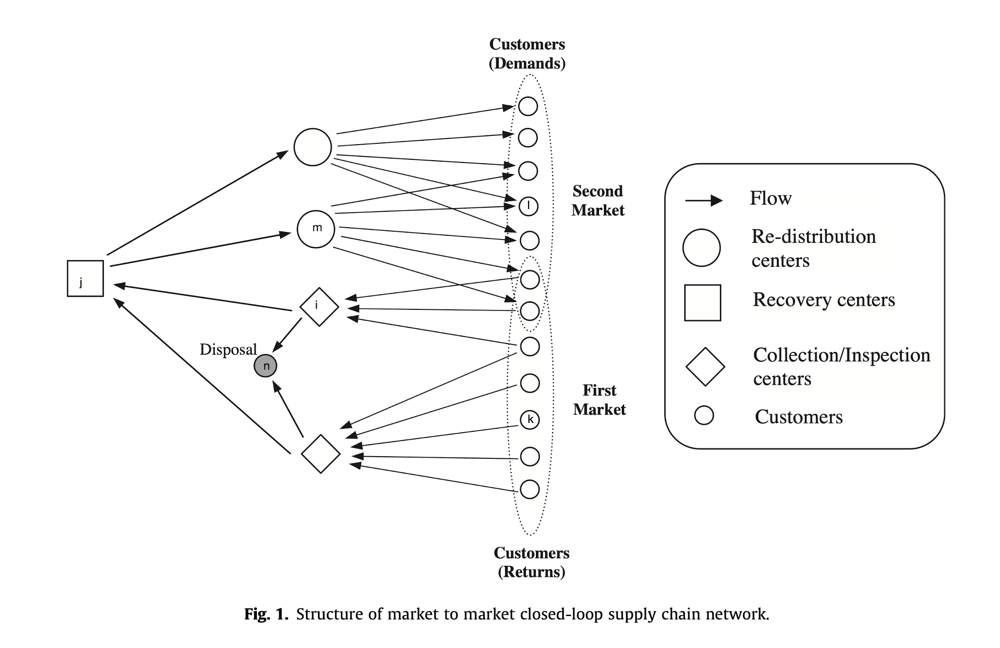
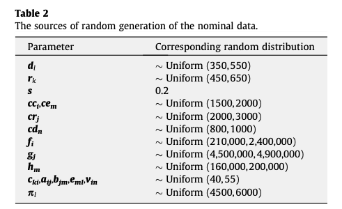
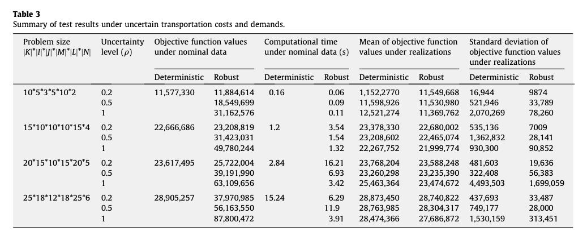

> '**\***' denotes uncertainty

## Sets
$I$: Sets of potential collection/inspection center locations  
$J$: Sets of potential recovery center locations  
$M$: Sets of potential redistribution center locations  
$N$: Sets of fixed locations of disposal centers  
$K$: Sets of fixed locations of first market customer zones (returns/push)   
$L$: Sets of fixed locations of second market customer zones (demand/pull)  
> $K$ and $L$ may have shared nodes.

## Parameters
### Nodes
$D^*_l$: Demands of customer $l$ for recovered products  
$R^*_k$:  Returns of used products from customer $k$  
$S$: Average disposal fraction  
$C^C_i$: Capacity of handling returned products at collection/inspection center $i$  
$C^R_j$: Capacity of handling recoverable products at recovery center $j$  
$C^E_m$: Capacity of handling recovered products at redistribution center $m$  
$C^D_n$: Capacity of handling scrapped products at disposal center $n$  
### Edges
$F_i$: Fixed cost of opening collection/inspection centor $i$  
$G_j$: Fixed cost of opening recovery centor $j$  
$H_m$: Fixed cost of opening redistribution centor $m$  
$C^*_{ki}$: Shipping cost per unit of returned products from customer zone $k$ to collection/inspection center $i$  
$A^*_{ij}$: Shipping cost per unit of recoverable products from collection/inspection center $i$ to recovery center $j$  
$B^*_{jm}$: Shipping cost per unit of recovered products from recovery center $j$ to redistribution center $m$  
$E^*_{ml}$: Shipping cost per unit of recovered products from redistribution center $m$ to customer zone $l$  
$V^*_{in}$: Shipping cost per unit of scrapped products from collection/inspection center $i$ to disposal center $n$  
$P_l$: Penalty cost per unit of non-satisfied demand of customer $l$

## Variables
$x_{ki}$: Quantity of returned products shipped from customer zone $k$ to collection/inspection center $i$  
$u_{ij}$: Quantity of recoverable products shipped from collection/inspection center $i$ to recovery center $j$  
$p_{jm}$: Quantity of recovered products shipped from recovery center $j$ to redistribution center $m$  
$q_{ml}$: Quantity of recovered products shipped from redistribution center $m$ to customer zone $l$  
$t_{in}$: Quantity of scrapped products shipped from collection/inspection center $i$ to disposal center $n$  
$\delta_{l}$: Quantity of non-satisfied demand of customer $l$  
$y_i$: $1$ if a collection/inspection center is opened at location $i$, 0 otherwise  
$z_j$:  $1$ if a recovery center is opened at location $j$, 0 otherwise  
$w_m$:  $1$ if a redistribution center is opened at location $m$, 0 otherwise  

## Objective
$\min$
$\displaystyle{\sum_{i \in I}F_iy_i + \sum_{j \in J}G_jz_j + \sum_{m \in M}H_mw_m +  \sum_{k \in K}\sum_{i \in I}C^*_{ki}x_{ki} + \sum_{i \in I}\sum_{j \in J}A^*_{ij}u_{ij} + \sum_{j \in J}\sum_{m \in M}B^*_{jm}p_{jm} + \sum_{m \in M}\sum_{l \in L}E^*_{ml}q_{ml} + \sum_{i \in I}\sum_{n \in N}V^*_{in}t_{in} + \sum_{l \in L}P_l\delta_{l}, * \in U^0_{box}}$  

## Constraints
c1  
$\displaystyle{\sum_{m \in M}q_{ml} + \delta_l \geq D^*_l, \forall l \in L, D^* \in U^1_{box}}$  
(actually the uncertainties are independent, treated like each row as a distinct set)  
c2  
$\displaystyle{\sum_{i \in I}x_{ki} \geq R^*_k, \forall k \in K, R^* \in U^2_{box}}$  
(actually the uncertainties are independent, treated like each row as a distinct set)  
c3  
$\displaystyle{\sum_{j \in J}u_{ij} - (1-S)\sum_{k \in K}x_{ki} = 0, \forall i \in I}$  
c4  
$\displaystyle{\sum_{n \in N}t_{in} - S\sum_{k \in K}x_{ki} = 0, \forall i \in I}$  
c5  
$\displaystyle{\sum_{j \in J}p_{jm} - \sum_{l \in L}q_{ml} = 0, \forall m \in M}$  
c6  
$\displaystyle{\sum_{m \in M}p_{jm} - \sum_{i \in I}u_{ij} \leq 0, \forall j \in J}$  
c7  
$\displaystyle{\sum_{k \in K}x_{ki} \leq y_iC^C_i, \forall i \in I}$  
c8  
$\displaystyle{\sum_{i \in I}u_{ij} \leq z_jC^R_j, \forall j \in J}$  
c9  
$\displaystyle{\sum_{j \in J}p_{jm}\leq w_m C^E_m, \forall m \in M}$  
c10  
$\displaystyle{\sum_{i \in I}t_{in} \leq C^D_n, \forall n \in N}$  
c11  
$y_i, z_j, w_m \in \{0, 1\}, \forall i \in I, j \in J, m \in M$  
c12  
$x_{ki}, u_{ij}, p_{jm}, q_{ml}, \delta_l \geq 0, \forall i \in I, j \in J, k \in K, l \in L, m \in M$

---

$a_0x_0 + a_1x_1 \geq b_0$  
$3x_0 + 4x_1 \geq 5$  
$[2, 4]x_0 + [3, 5]x_1 \geq [4,6]$  

---
$3.1x_0 + 4x_1 \geq 5$  
$3.2x_0 + 4x_1 \geq 5$  
$3.3x_0 + 4x_1 \geq 5$  
$3.11x_0 + 4x_1 \geq 5$  
$3.12x_0 + 4x_1 \geq 5$  
.  
.  
.  